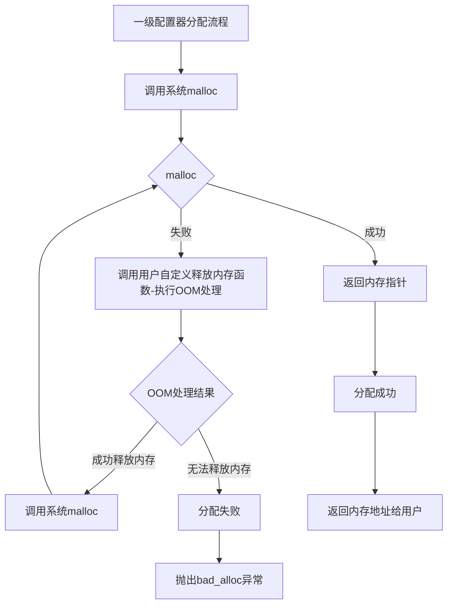

# STLsomething
# 简介

该仓库主要是为了学习STL源代码而设置的仓库，目前是通过阅读【侯捷】老师的《STL源码刨析》简体中文翻译来阅读和学习

# 空间配置器(allocator)

## STL标准空间配置器接口

```cpp
allocator::value_type		// 值类型
allocator::pointer			// 指针类型
allocator::const_pointer	// 常量指针
allocator::reference		// 引用类型
allocator::const_reference	// 常量引用
allocator::size_type		// size_t类型,STL源码当中当入参传递也仅仅使用size_t类型
allocator::difference_type	// ptrdiff_t类型,STL源码当中未见使用
```

```cp
allocator::rebind()			// STL阅读当中未见使用
// 一个嵌套的(nested) class template. class rebind<U>拥有唯一成员other,那是一个typedef,代表allocator<U>
```

```cpp
allocator::allocator()
// default constructor -- 默认构造函数

allocator::allocator(const allocator&)
// copy constructor		--拷贝构造函数

template<class U>allocator::allocator(const allocator<U>&)
// 泛化的copy constructor
```

```cpp
allocator::~allocator()
// default constructor	-- 默认析构函数
```

```cpp
pointer allocator::address(reference x) const
// 返回某个对象的地址。算式 a.address(x) 等价于 &x

const_pointer allocator::address(const_reference x) const
// 返回某个 const 对象的地址。算式 a.address(x) 等同于 &x
```

```cpp
pointer allocator::allocate(size_type n, const void* = 0)
// 配置空间，足以存储n个T对象。第二个参数是个提示。实现上可能会利用它来增进区域性，或完全忽略之

void allocator::deallocate(pointer p, size_type n)
// 归还先前配置的空间
```

```cpp
size_type allocator::max_size() const
// 返回可成功配置的最大量
```

```cpp
void allocator::construct(pointer p, const T& x)
// 等同于 new(const void* p) T(x)		-- 就是一个placement new 在指定内存区域调用构造函数

void allocator::destroy(pointer p)
// 等同于 p->~T()
```

## SGI空间配置器

SGI空间配置器总共有两级配置器，分别如下：

1. 一级：封装了`malloc()` 和`free()` ，增加了一个异常机制
2. 二级：有特定的算法来判断，简要说明如下：
   1. 内存大于128bytes时：转去调用一级配置器
   2. 内存小于等于128bytes时：采用更复杂的方式管理--详细见二级配置器详解

### 一级配置器



```cpp
static void *allocate(size_t n)
{
    void *result = malloc(n); // 第一集配置器直接使用malloc()
    /*
    	malloc失败时,启动oom_malloc申请内存
    */
    if (0 == result)
        result = oom_malloc();
    return result;
}

template <int inst>
void *__malloc_alloc_template<inst>::oom_malloc(size_t n)
{	
    /*
    	调用该函数,肯定已经向系统申请过内存并且失败,证明此时系统已经没有空闲内存
    	因此：
            调用用户自定义释放内存的函数--目的将用户的空闲内存返还操作系统
                调用成功,用户释放内存：
                    再次向操作系统申请内存
                        申请成功：分配内存成功给用户
                        申请失败：用户释放内存不够新申请,重复执行用户释放内存，申请内存操作,直至分配成功或抛出异常
                调用失败,用户无空闲内存：
                	用户和系统都无空闲内存,抛出异常
    */
    void (*my_malloc_handler)();		// 定义函数指针变量
    void *result;

    for (;;) // 不断尝试释放、配置、再释放、再配置...
    {
        my_malloc_handler = __malloc_alloc_oom_handler;		// 设置用户自定义内存释放函数
        if (0 == my_malloc_handler)			// 用户没有自定义释放内存函数
        {
            __THROW_BAD_ALLOC;				// 直接抛出异常
        }
        (*my_malloc_handler)(); 	// 调用用户自定义释放内存函数，企图释放内存
        result = malloc(n);     	// 再次尝试申请内存
        if (result)
            return (result);
    }
}
```

### 二级配置器

``````mermaid
graph TD
    A[分配请求] --> B{n > 128}
    
    B -->|是| C[一级分配器]
    B -->|否| D[对齐大小]
    
    D --> E[计算索引]
    E --> F{链表空吗}
    
    F -->|不空| G[取链表头]
    G --> H[更新链表]
    H --> I[返回内存]
    
    F -->|空| J[调用refill]
    J --> K[调用chunkalloc]
    
    K --> L{内存池状态}
    
    L -->|充足| M[切20区块]
    L -->|部分| N[切可用区块]
    L -->|不足| O[处理不足]
    
    M --> P[返回区块]
    N --> Q[调整数量]
    Q --> P
    
    O --> R[分配新池]
    R --> S{malloc结果}
    
    S -->|成功| T[更新指针]
    S -->|失败| U[试更大链表]
    
    T --> K
    U --> V{找到内存吗}
    
    V -->|是| W[借用内存]
    V -->|否| X[转一级OOM]
    
    W --> K
    X --> C
    
    P --> Y{区块数量}
    
    Y -->|单个| Z[直接返回]
    Y -->|多个| AA[构建链表]
    
    AA --> AB[存入链表]
    AB --> AC[返回首个]
    
    I --> END[结束]
    Z --> END
    AC --> END
    C --> END
    
    style B fill:#ffecb3,shape:diamond
    style F fill:#ffecb3,shape:diamond
    style L fill:#ffecb3,shape:diamond
    style S fill:#ffecb3,shape:diamond
    style V fill:#ffecb3,shape:diamond
    style Y fill:#ffecb3,shape:diamond
    
    style END fill:#4caf50
``````

```cpp
static void *allocate(size_t n)
{
    obj *volatile *my_free_list;
    obj *result;

    // 大于128就调用第一级配置器
    if (n > (size_t)__MAX_BYTES)
    {
        return (malloc_alloc::allocate(n));
    }
    // 在16个free lists中适当的一个自由链表
    // FREELIST_INDEX函数会根据区块大小,决定使用第n号free-list。n从1起算
    my_free_list = free_list + FREELIST_INDEX(n);
    result = *my_free_list;
    if (0 == result)
    {
        // 没找到可用的free list,准备重新填充free list
        // ROUND_UP会根据bytes上调至8的倍数，例如4bytes->8bytes
        void *r = refill(ROUND_UP(n));
        return r;
    }
    *my_free_list = result->free_list_link;
    return result;
}

template <bool threads, int inst>
void *__default_alloc_template<threads, inst>::refill(size_t n)
{
    int nobjs = 20;
    // 调用chunk_alloc(),尝试取得nobjs个区块作为free list的新节点
    // 注意参数nobjs是pass by reference
    char *chunk = chunk_alloc(n, nobjs);
    obj *volatile *my_free_list;
    obj *result;
    obj *current_obj, *next_obj;
    int i;
    // 如果只获得一个区块，这个区块就分配给调用者用，free list无新节点
    if (1 == nobjs)
        return (chunk);
    // 否则准备调整free list,纳入新节点
    my_free_list = free_list + FREELIST_INDEX(n);

    // 以下在chunk空间内建立free list
    result = (obj *)chunk; // 这一块准备返回给客户端
    // 以下导引free list指向新配置的空间(取自内存池)
    *my_free_list = next_obj = (obj *)(chunk + n);
    // 以下将free list的各节点串接起来
    for (i = 1;; ++i)
    {
        current_obj = next_obj;
        next_obj = (obj *)((char *)next_obj + n);
        if (nobjs - 1 == i)
        {
            current_obj->free_list_link = 0;
            break;
        }
        else
        {
            current_obj->free_list_link = next_obj;
        }
    }
    return (result);
}

template <bool threads, int inst>
char *__default_alloc_template<threads, inst>::chunk_alloc(size_t size, int &nobjs)
{
    char *result;
    size_t total_bytes = size * nobjs;		   // 需要申请的内存大小
    size_t bytes_left = end_free - start_free; // 内存池剩余空间

    if (bytes_left >= total_bytes)
    {
        // 内存池剩余空间完全满足需求量
        result = start_free;
        start_free += total_bytes;
        return (result);
    }
    else if (bytes_left >= size)
    {
        // 内存池剩余空间不能完全满足需求量，但足够供应一个（含）以上的区块
        nobjs = bytes_left / size;
        total_bytes = size * nobjs;
        result = start_free;
        start_free += total_bytes;
        return (result);
    }
    else
    {
        // 内存池剩余空间连一个区块的大小都无法提供
        size_t bytes_to_get = 2 * total_bytes + ROUND_UP(heap_size >> 4);
        // 以下试着让内存池中的残余零头还有利用价值
        if (bytes_left > 0)
        {
            // 内存池还有一些零头，先配给适当的free list
            // 首先寻找适当的free list
            obj *volatile *my_free_list = free_list + FREELIST_INDEX(bytes_left);
            // 调整free list,将内存池中的残余空间编入
            ((obj *)start_free)->free_list_link = *my_free_list;
            *my_free_list = (obj *)start_free;
        }

        // 配置heap空间，用来补充内存池
        start_free = (char *)malloc(bytes_to_get);
        if (0 == start_free)
        {
            // heap空间不足,malloc()失败
            int i;
            obj *volatile *my_free_list, *p;
            // 试着检视我们手上拥有的东西,这不会造成伤害,我们不打算尝试配置
            // 较小的区块,因为那在多进程(multi-process)机器上容易导致灾难
            // 以下搜索适当的free list
            // 所谓适当是指 “尚有未用区块，且区块勾搭”之free list
            for (i = size; i <= __MAX_BYTES; i += __ALIGN)
            {
                my_free_list = free_list + FREELIST_INDEX(i);
                p = *my_free_list;
                if (0 != p) // free list内尚有未用区块
                {
                    // 调整free list以释放未用区块
                    *my_free_list = p->free_list_link;
                    start_free = (char *)p;
                    end_free = start_free + i;
                    // 递归调用自己,为了修正nobjs
                    return (chunk_alloc(size, nobjs));
                    // 注意：任何残余零头终将被编入适当的free list中备用
                }
            }
            end_free = 0; // 如果出现意外(到处都没内存可用了)
            // 调用第一级配置器，看看out-of-memory机制能否尽点力
            start_free = (char *)malloc_alloc::allocate(bytes_to_get);
            // 这会导致抛出异常(exception)或内存不足的情况获得改善
        }
        heap_size += bytes_to_get;
        end_free = start_free + bytes_to_get;
        // 递归调用自己,为了修正nobjs
        return (chunk_alloc(size, nobjs));
    }
}
```

